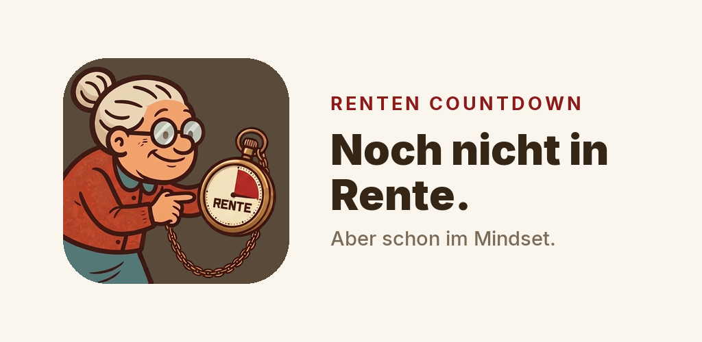
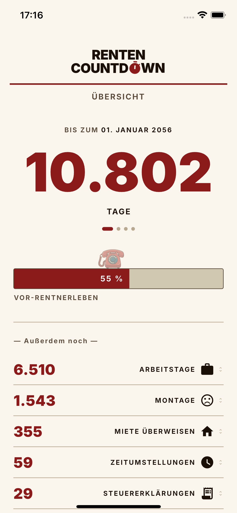
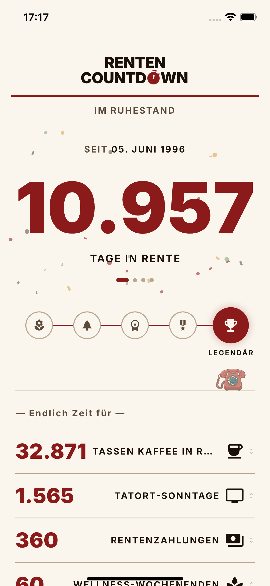

# Renten Countdown

**Noch nicht in Rente, aber schon im Mindset.**

Der ehrliche Countdown bis zur Rente.

&nbsp;
&nbsp;
&nbsp;

**[Website](https://bt-tran.github.io/Renten-Countdown/)** · **[Datenschutz](https://bt-tran.github.io/Renten-Countdown/datenschutz.html)** · **[Impressum](https://bt-tran.github.io/Renten-Countdown/impressum.html)**

 

## Über die App

Irgendwann ist Schluss. Bis dahin: zählen.

**Renten Countdown** zeigt dir schwarz auf Creme, wie viele Tage du noch bis zur Rente absitzt. Kein „Du schaffst das!", kein Motivations-Konfetti, keine Rentenprognose mit drei Sternchen — nur die ehrliche Zahl und eine Oma, die ihren Senf dazugibt. Für alle, die innerlich längst im Liegestuhl liegen, körperlich aber noch im Büro sitzen.

Die App kennt zwei Stimmungen. Bis zum großen Tag läuft der **Countdown**: direkt, trocken, mit schwarzem Humor. Ist es so weit, schaltet sie in den **Ruhestand-Modus**: warm, gelassen, ohne Sarkasmus. Jetzt hast du es dir verdient.

> Was die App **nicht** ist: kein Rentenrechner, keine Finanzberatung, kein Motivationstrainer. Gott bewahre.

## Funktionen

- **Der große Countdown** — Tage bis zur Rente, gnadenlos genau, in mehreren Formaten.
- **Kuriose Statistiken** — wie viele Montage, Meetings und Kaffeepausen noch vor dir liegen.
- **Eine Oma mit loser Zunge** — freche Sprüche und Cameo-Auftritte, die keiner bestellt hat.
- **Tagesspruch um 12:30** — pünktlich zur Mittagspause, frei Haus.
- **Postkarten-Studio** — teilbare Postkarten, damit auch die Kollegen wissen, woran sie sind.
- **Zählwerk** — eigene kleine Counter für alles, worauf du sonst noch wartest.
- **Fax / Stille Post** — dein Leben als Zeitstrahl, Jahrzehnt für Jahrzehnt.
- **Ruhestand-Modus** — Auszeichnungen und Konfetti, sobald der Tag gekommen ist.
- **Native Widgets** — Countdown auf dem Sperrbildschirm (iOS, inkl. Live Activity) und auf dem Homescreen (iOS & Android).
- **Kaffee für die Oma** — ein freiwilliger In-App-Tipp, mehr nicht.
- **Deine Daten bleiben bei dir** — kein Konto, kein Login, kein Tracking, keine Werbung.

## Screenshots

  
  &nbsp;&nbsp;
  

Links: der Countdown vor der Rente. Rechts: der warme Ruhestand-Modus.

## Plattform & Technik

Gebaut mit **Flutter / Dart**. Läuft auf **iOS 16+** und **Android 6+ (API 23)**, inklusive nativer Widgets (WidgetKit / App Widget). Kein Backend, kein Login — alles läuft offline auf dem Gerät.

> Der App-Quellcode ist nicht Teil dieses Repositorys.

## Über dieses Repository

Dieses Repo enthält die **offizielle Website** zur App, veröffentlicht über GitHub Pages aus dem Ordner [`docs/`](docs/) → **https://bt-tran.github.io/Renten-Countdown/**

| Seite | Zweck |
|---|---|
| [`docs/index.html`](docs/index.html) | Smart-Link — erkennt iOS/Android und leitet zum passenden Store weiter |
| [`docs/datenschutz.html`](docs/datenschutz.html) | Datenschutzerklärung |
| [`docs/impressum.html`](docs/impressum.html) | Impressum |

Hinweis für später: Sobald die App live ist, in <code>docs/index.html</code> die Store-Weiterleitung über <code>APPLE_APP_ID</code> bzw. <code>ANDROID_LIVE</code> aktivieren.

## Datenschutz

Renten Countdown erhebt **keine personenbezogenen Daten**: kein Konto, kein Tracking, keine Werbung. Alles, was du eingibst, bleibt lokal auf deinem Gerät. Details in der [Datenschutzerklärung](https://bt-tran.github.io/Renten-Countdown/datenschutz.html).

## Verfügbarkeit

Bald im App Store und im Play Store. Bis dahin führt die [Website](https://bt-tran.github.io/Renten-Countdown/) automatisch zum passenden Store, sobald er bereitsteht.

## Impressum & Kontakt

Bao Anh Tran · Nürnberg · [tran-bao-anh@outlook.de](mailto:tran-bao-anh@outlook.de)

Vollständige Angaben im [Impressum](https://bt-tran.github.io/Renten-Countdown/impressum.html).

## Lizenz

© 2026 Bao Anh Tran. Alle Rechte vorbehalten.

Renten Countdown ist eine proprietäre Anwendung — dieses Repository steht **nicht** unter einer Open-Source-Lizenz. Name, Gestaltung und Inhalte sind urheberrechtlich geschützt.
